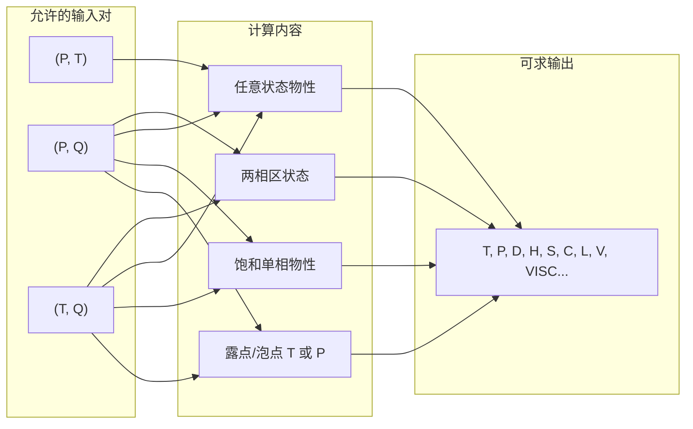

# 混合冷媒常用参数计算策划

本文档说明可压缩混合物（HEOS）在工程中常用的参数计算方式，以及在本项目中的实现约定。

## 计算内容总览

可压缩混合物**仅支持**以下三种状态输入对：**(P,T)**、**(P,Q)**、**(T,Q)**。**不支持** (P,H)、(T,H) 等（即不能“已知压力+焓”或“已知温度+焓”反求另一状态量；纯流体支持）。组分固定为**摩尔分数**，质量分数需自行换算。

按用途分类，混合冷媒可做的计算如下：

| 计算内容分类 | 含义 | 典型输入 | 典型输出 | 对应输入对 |
|-------------|------|----------|----------|------------|
| **露点/泡点** | 饱和温度或饱和压力 | 给定 P 或 T + 干度 Q=0/1 | T 或 P | (P,Q)、(T,Q) |
| **饱和单相物性** | 饱和液或饱和气在某状态下的物性 | P+Q=0/1 或 T+Q=0/1 | D、H、S、C、L、V、VISC 等 | (P,Q)、(T,Q) |
| **任意单相/两相物性** | 已知 T、P 或 T、Q 或 P、Q 求任意物性 | (T,P)、(P,Q)、(T,Q) | 同上 | 三种均可 |
| **两相区状态** | 0<Q<1 的混合相态 | P+Q 或 T+Q | T/P/D/H/S… | (P,Q)、(T,Q) |

## 输入-输出能力简表

三种输入对 **(P,T)**、**(P,Q)**、**(T,Q)** 均可求下列输出（`output_key`）：**T**、**P**、**D**、**H**、**S**、**C**、**L**、**V**、**VISC** 等（与 API 2.2 节物性代码一致）。露点/泡点即 (P,Q) 或 (T,Q) 配 Q=0/1、输出 T 或 P 的特例。

## 1. 露点与泡点

详见上方计算内容总览。具体约定如下。

| 名称 | 含义 | 输入 | 输出 | API 调用方式 |
|------|------|------|------|--------------|
| **泡点温度** | 给定压力下，饱和液体（第一滴蒸气出现）的温度 | P + Q=0 | T | `output_key=T`, `input1_key=P`, `input2_key=Q`, `input2_value=0` |
| **露点温度** | 给定压力下，饱和蒸气（第一滴液体出现）的温度 | P + Q=1 | T | `output_key=T`, `input1_key=P`, `input2_key=Q`, `input2_value=1` |
| **泡点压力** | 给定温度下，饱和液体的压力 | T + Q=0 | P | `output_key=P`, `input1_key=T`, `input2_key=Q`, `input2_value=0` |
| **露点压力** | 给定温度下，饱和蒸气的压力 | T + Q=1 | P | `output_key=P`, `input1_key=T`, `input2_key=Q`, `input2_value=1` |

- 干度 **Q=0**：纯饱和液体（泡点）
- 干度 **Q=1**：纯饱和蒸气（露点）
- 混合冷媒的泡点与露点温度/压力不一致（有相平衡滑移），需用上述 (P,Q) 或 (T,Q) 组合通过 CoolProp 计算。

## 2. 饱和性质（单相）

在泡点或露点状态下（详见计算内容总览），可进一步求其它物性：

| 计算 | 输入 | 输出示例 |
|------|------|----------|
| 饱和液体密度 | P + Q=0 | D, H, S, C, L, VISC… |
| 饱和蒸气密度 | P + Q=1 | D, H, S, C, L, VISC… |
| 饱和液体焓/熵 | T + Q=0 或 P + Q=0 | H, S |
| 饱和蒸气焓/熵 | T + Q=1 或 P + Q=1 | H, S |

即：先固定 (P,Q) 或 (T,Q) 为饱和状态，再选 `output_key` 为 D、H、S 等即可。

## 3. 两相区与过热/过冷

与计算内容总览中的「任意单相/两相物性」「两相区状态」对应。

- **两相区**：0 < Q < 1，由 (P,T)、(P,Q)、(T,Q) 等两参数确定状态后求任意物性。
- **过热蒸气**：T > 露点温度（在相同 P 下），或等价地用 (P,T) 指定。
- **过冷液体**：T < 泡点温度（在相同 P 下），或等价地用 (P,T) 指定。

混合冷媒的“饱和线”在 T-P 图上为两条线（泡点线、露点线），两线之间为两相区。

## 4. 本项目中已实现

- **常量**（`src/lib/constants.js`）  
  - `INPUT_PAIRS` 中增加 **P + Q**，用于给定压力求泡点/露点温度。  
  - `HEOS_QUICK_CALCS`：泡点温度、露点温度、泡点压力、露点压力四种快捷计算预设。

- **界面**（`HeosMixtureForm.jsx`）  
  - “混合冷媒常用计算”下拉框：选择一项后自动填入对应的状态参数对、输出量及 Q=0 或 Q=1，用户只需改压力或温度即可计算。

## 5. 可选扩展（后续）

- **饱和液/气焓差**：同一 (P 或 T) 下 H(Q=1)−H(Q=0)，用于冷量或换热估算。
- **临界点**：混合物的 Tcrit、Pcrit（若 CoolProp 提供）。
- **T-P 饱和曲线**：固定组分，扫 P 或 T 得到泡点线、露点线数据用于绘图。
- **质量分数与摩尔分数换算**：界面侧提供质量分数输入，内部转为摩尔分数再调用 API。

以上露点、泡点及饱和性质计算均基于现有 `POST /api/props`，无需改后端，仅需前端选用合适的 (input_pair, output_key, Q) 组合。
